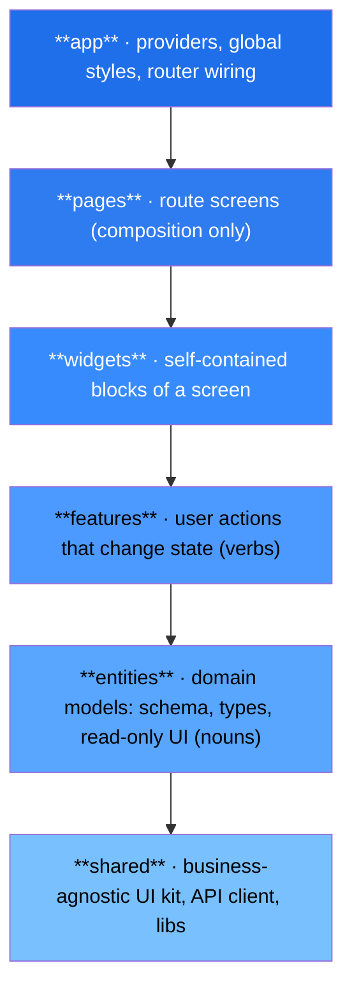
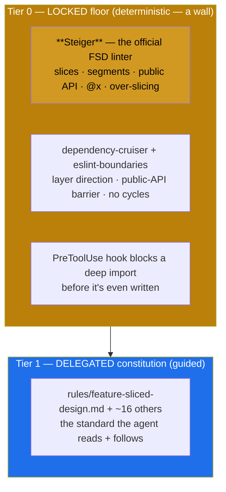
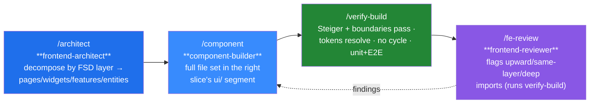
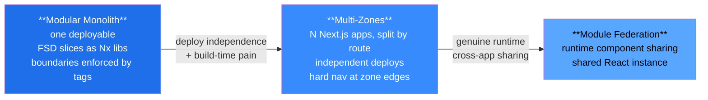

# Your architecture is a decision. Bedrock makes Claude Code follow it — on every change.

*A Next.js/React engineering constitution, built on Feature-Sliced Design and packaged as a Claude Code plugin — so the architecture you decided on is the architecture you actually get, from every contributor, human or AI agent.*

---

Every frontend codebase answers one question thousands of times: **where does this file go, and what is it allowed to import?** Get it right and the codebase stays legible for years. Get it wrong — a little, repeatedly — and you get the thing every senior engineer has lived through: features reaching into each other's internals, a "shared" folder that's secretly the whole app, circular imports that break tree-shaking, and a dependency graph nobody can hold in their head.

That decay used to happen at human speed — one rushed PR at a time. It now happens at **machine speed**. An AI coding agent will answer "where does this go?" forty times in one session, confidently, across forty files — and it will answer *consistently wrong* if nothing holds it to your architecture. The agent isn't malicious; it's pattern-matching against a million repos that disagree with yours.

This post is about closing that gap. Three things, in order:

1. **The architecture** — [Feature-Sliced Design](https://feature-sliced.design/) (FSD): a standardized, *mechanically checkable* answer to "where does this go and what may it import," and how it maps onto the Next.js App Router specifically.
2. **Making it stick** — why a documented architecture loses to deadlines and autocomplete, and the two-tier enforcement (a deterministic linter floor + a guided constitution) that makes FSD survive contact with the next contributor.
3. **And when you outgrow one app** — the modular-monolith → Multi-Zones → Module Federation spectrum, and the Next.js reckoning most articles skip. FSD slices are the unit you carry across all of it.

> **Where this comes from, honestly.** The methodology below was sharpened over several large React monorepos before it had a name. Bedrock is the *packaging* — the standard turned into something installable and enforced. The methodology is proven; this distribution is new. I'll be precise about which is which.

---

## 1. The architecture: a checkable answer to "where does this go?"

Most folder conventions are *vibes* — "components here, utils there" — and vibes don't survive a team, let alone an agent. Feature-Sliced Design replaces vibes with a fixed, ordered set of **layers**, each sliced by business domain, each sliced again by technical purpose. The structure itself tells you the scope and blast radius of any change.

### The six layers



Read top to bottom, most app-specific to most generic. A grievance-management app makes it concrete: `entities/employee` and `entities/collective-agreement` are the *nouns* (a model, its Zod schema, a read-only `<EmployeeCard>`). `features/file-grievance` and `features/resolve-dispute` are the *verbs* (the form, the validation, the Server Action that mutates). `widgets/grievance-dashboard` is the *block* that composes them. `pages/active-grievances` is the *screen*. `shared/ui` is the `<Button>` and `<DataTable>` that know nothing about grievances at all.

### The one rule that does all the work

> **A module can only import from layers strictly *below* it.** Never upward. Never from another slice on the *same* layer.

That's the whole methodology. `features` may use `entities` and `shared`; `entities` may use only `shared`; `shared` imports nothing above it. `features/file-grievance` **cannot** import `features/resolve-dispute` — if two features need each other, the **page or widget above them** composes them. The payoff is **isolation**: rewrite a slice's internals and nothing outside breaks, because the only thing the outside ever touched was the slice's **public API** — its `index.ts`.

```ts
// ❌ ILLEGAL — a deep import reaches past the public API into another slice's guts
import { EmployeeCard } from '@/entities/employee/ui/cards/EmployeeCard';

// ✅ REQUIRED — import the slice through its public API; its internals can change freely
import { EmployeeCard } from '@/entities/employee';
```

There's exactly one sanctioned escape hatch for the genuine case where two domain models relate — a `collective-agreement` that references the `employee` it covers: the **`@x` cross-import**, a scoped public API one entity publishes *for* another. It's deliberately the only same-layer exception, deliberately confined to `entities`, and deliberately ugly so you keep it rare. That single, named exception is the answer to the question every "where do shared types go?" thread devolves into — and it beats the usual default of dumping the type in `shared`, because `shared` is supposed to be business-agnostic.

### FSD on the Next.js App Router (the part that trips teams up)

FSD has layers literally named `app` and `pages`. So does the Next.js App Router. They collide. The official, boring resolution — and the one Bedrock encodes:

```text
/app/                         ← Next.js routing ONLY (thin, no logic)
  active-grievances/page.tsx  → export { ActiveGrievancesPage as default } from '@/pages/active-grievances'
/src/                         ← every FSD layer
  app/        providers, the 'use client' shell, global styles
  pages/      active-grievances/ui/ActiveGrievancesPage.tsx   (a Server Component)
  widgets/    grievance-dashboard/
  features/   file-grievance/   resolve-dispute/
  entities/   employee/   collective-agreement/
  shared/     ui/  api/  lib/  config/
```

Next's `app/` stays at the repo root and does nothing but re-export the FSD `pages` layer. Everything real lives under `src/`. That keeps two architectural truths intact at once: **Server Components by default** (data fetched high — entity queries in the page/widget, passed *down* as props), and **`'use client'` pushed to the leaves** (the interactive bits live inside features and widgets, never at the top of a route). Reads flow down; mutations flow up (a feature's Server Action fires, then revalidates, and the top of the tree re-fetches). The architecture and the framework's grain point the same way.

---

## 2. The real problem: decisions don't enforce themselves

Here's the part that has nothing to do with FSD specifically and everything to do with why your *last* architecture eroded.

You pick FSD. You write the ADR. You put the layer diagram in the wiki. Then:

- A new hire deep-imports `@/entities/employee/ui/EmployeeCard` because their editor autocompleted it, and nothing complained.
- Someone puts a "Delete Employee" button — a *mutation* — inside the `employee` entity, because it was right there, and now the entity isn't read-only anymore.
- Six months later a `shared/lib/grievance-helpers.ts` exists, business logic and all, because `shared` was the path of least resistance.
- And now an **AI agent** does all three at machine speed, across forty files, confidently — because the average of its training data says deep imports and grab-bag `shared` folders are normal.

Documentation is advisory. **Advisory loses to deadlines and to autocomplete.** The FSD decision in section 1 only matters if *every change* — human or agent — is held to it. Bedrock's answer is two tiers, and the honesty about which is which is the whole point.



**Tier 0 is genuinely deterministic — it doesn't care if the contributor is a person or an LLM.** [Steiger](https://github.com/feature-sliced/steiger) is the *official* FSD architectural linter; it's the only tool that natively understands slices, segments, the public-API barrier, the `@x` notation, and over-slicing. A `dependency-cruiser` config encodes the layer-direction rule and the no-deep-import barrier as build-breaking [fitness functions](https://www.oreilly.com/library/view/building-evolutionary-architectures/9781492097532/). A [`PreToolUse` hook](https://code.claude.com/docs/en/hooks-guide) — a shell command the harness runs, *not* the model — can block a banned deep import before the agent writes it. This tier is a wall.

**Tier 1 is guided, not guaranteed.** The constitution shapes a probabilistic model. It's *strong* guidance — reinforced by a Recon gate and a reviewer agent — but it isn't a wall, and calling it "enforced" the way the linter is would be dishonest. The design philosophy is exactly that split: **drift resistance is a function of the enforcement mechanism, not documentation quality** — so anything that truly must hold (the import rule, no cycles) goes in Tier 0; the judgment calls stay Tier 1.

### Why the agent doesn't hallucinate your token names

One Bedrock detail matters specifically because the contributor might be an AI: **Step 0 Recon.** Before generating code, the agent must read the *actual* repo — its `package.json` scripts, its `tsconfig` path aliases, its real design-token names, its existing slices — and write a Recon block. Every example name in the rules is explicitly marked illustrative-until-verified. This is what stops an agent from confidently writing `pnpm tokens:build` or importing `@/entities/employee/model/employee` because it saw something like it in a template. The repo's reality wins over the doc; a contradiction gets *flagged*, not silently absorbed.

### The day-to-day loop

In a Bedrock project, the work is a plan → build → verify → review loop, each step a [subagent](https://code.claude.com/docs/en/sub-agents) with its own context window and its placement rules pre-loaded:



The architect decomposes *by layer* and refuses to invent a same-layer import — it plans the page that composes two features instead. The reviewer doesn't just opine; it runs `/verify-build`, which runs Steiger, and returns an evidence-backed verdict. A misplaced mutation or a deep import is a **Blocker**, not a comment.

---

## 3. And when you outgrow one app: the scale spectrum

FSD answers "how is one app structured." The moment you have multiple teams or a build that's too slow, a second question appears: **does this still need to be one deployable?** Most "should we use micro-frontends?" debates skip the only part that matters — *where on the spectrum are you, and have you earned the next step?* Adoption in one widely-cited survey actually *fell* from 75.4% in 2022 to 23.6% in 2024 — not because the idea was wrong, but because teams stopped reaching for the heaviest tool first.[^sof]



The crucial bit: **the FSD slice is the unit you carry across the whole spectrum.** In a modular monolith each slice is an Nx library; promote one to its own deploy and it becomes a Multi-Zone app or a remote — *same internal structure*, so the move is structural, not a rewrite. The layers even map onto ownership: the **Platform team** owns `shared/` and `app/` (a change there ripples to everyone, so it's a hard review gate); **domain teams** own their slices in `entities/` and `features/` with full autonomy — and FSD's public-API barrier *is* the team contract, because no one can reach past your `index.ts`.

**The Next.js reckoning most articles skip:** on the App Router, **Module Federation is not a safe default in 2026.** The maintainer himself put `@module-federation/nextjs-mf` into [maintenance mode](https://github.com/module-federation/core/issues/3153) (Nov 2024): Pages Router stays supported, App Router gets no such commitment, and around late 2026 the core team stops tracking it. Two precisions a sharp reader will check: it is **not npm-deprecated** (still publishing 8.x), and it's **not technically impossible — it's deliberately blocked** ([*"Technically it works. But I have blocked the feature for now"*](https://github.com/vercel/next.js/discussions/77862)) because App Router's RSC + Turbopack assumptions break the legacy webpack-runtime patching. There's a real Vercel ↔ Module Federation collaboration landing native federation via the Turbopack/Rspack path (Next 15.3+) — so the honest framing is *"the legacy plugin is sunsetting; native federation is the bet, and it isn't here yet."* The practical default: **modular monolith → Multi-Zones → treat App Router federation as a last resort whose tooling is mid-transition.** Bedrock's `monorepo-architect` walks exactly this guide and cites this reality, not a stale 2024 blog.

---

## How Bedrock actually helps you — concretely

If you're an engineering lead bringing AI agents into a Next.js codebase, here's what changes on Monday:

- **"Where does this go?" stops being a debate.** The agent (and the new hire) place a read-only view in `entities/<x>/ui`, an action in `features/<x>`, a screen in `pages/`, a `<Button>` in `shared/ui` — because the rule is explicit and a linter checks it. Code review stops re-litigating folder structure.
- **The agent can't quietly entangle your domains.** A deep import, an upward import, a same-layer feature-to-feature import, a mutation smuggled into an entity, business logic in `shared` — each is a **build-breaking** failure, caught by Steiger/dependency-cruiser or blocked by a hook before it lands. Architectural drift at machine speed is the failure mode AI introduces; this is the guardrail for it.
- **Refactors stay local.** Because every slice is reached only through its `index.ts`, a team can rewrite a slice's internals without a cross-repo blast radius. That's the isolation guarantee that makes a big codebase survivable.
- **It's not just FSD.** The same plugin enforces design tokens (no hardcoded hex), accessibility (WCAG 2.2 AA), TypeScript strictness (no `any`), React Query data patterns, testing (unit + E2E, both required), i18n, performance budgets, security, and an enterprise governance layer — ~17 rule files, each loaded only when relevant so the agent's context stays small.
- **Adoption is two commands**, and it never overwrites your project's own memory:

```text
# one time, per machine
/plugin marketplace add https://github.com/Zero-One-Stack/bedrock
/plugin install bedrock@zos

# in each project
/bedrock:kit-init          # copies the constitution (CLAUDE.md + rules/) into ./.claude/
/bedrock:enterprise-init   # wires Steiger + CI fitness functions, hooks, ADR + policy scaffolding
```

A deliberate design note: **`CLAUDE.md` is intentionally one page** — hard bans plus a routing table. Depth lives in `rules/`, each file loaded *only when relevant to the task* ([progressive disclosure](https://code.claude.com/docs/en/skills)). The model carries a one-page router and pulls in `feature-sliced-design.md` only when it's deciding placement — not 17 rule files on every turn. (And a plugin *can't* auto-load `CLAUDE.md` into your repo — project memory is version-controlled and team-owned — which is why `kit-init` copies it in explicitly and idempotently, never touching your `project-specifics.md`.)

---

## Where this is, honestly

Bedrock is **shipped and installable today** — the plugin, the marketplace, the FSD architecture rule, ~16 more rules, the agents, the hooks, and the Steiger + dependency-cruiser + CI fitness functions. What it does *not* yet have is a public production case study with numbers; proving it end-to-end on a live portfolio project is the current frontier, and the CI globs/configs ship as illustrative scaffolding you point at your real scripts on adoption. The *methodology* is battle-tested across real monorepos; this *packaging* of it — and the Steiger-backed FSD enforcement — is the new part. I'd rather tell you that than imply a maturity it hasn't earned.

The pattern generalizes, too. Bedrock is a Next.js/React kit, but the shape — thin constitution + on-demand rules + a Recon gate + a plan/build/verify/review loop + a locked-floor/guided-constitution split — is stack-agnostic. A backend/API or React Native kit is the same skeleton with different rules. Blueprinted, not yet built; I'd rather sell the pattern than imply a suite exists.

## The takeaway

Your architecture was always a decision — FSD's layers and its one import rule are just an unusually *checkable* way to write that decision down. The hard part was never making the decision; it's making it survive the next contributor, including the one that types at 200 tokens a second. Put the parts that must hold behind a deterministic linter, guide the rest with a constitution the agent actually reads, and "where does this go?" stops being a question your codebase slowly answers wrong.

That's the whole idea behind Bedrock. The architecture is the decision; the plugin is how the decision keeps holding.

---

*Bedrock is MIT-licensed. Install: `/plugin marketplace add https://github.com/Zero-One-Stack/bedrock` → `/plugin install bedrock@zos`.*

[^sof]: The Software House *State of Frontend* survey, reported via [heise (Sep 2025)](https://www.heise.de/en/background/Why-many-teams-are-better-off-with-monoliths-than-with-micro-front-ends-10639162.html). One survey's self-reported figure — directionally striking, methodology-dependent.
