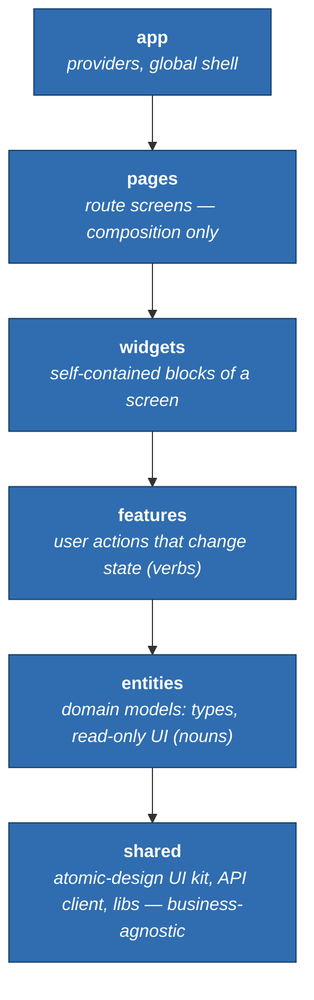

<p align="center">
  
</p>

<h1 align="center">Bedrock</h1>

<p align="center">
  Enforced Next.js + React engineering standards for <a href="https://claude.com/claude-code">Claude Code</a>.
</p>

---

## What is Bedrock?

Bedrock is a **Claude Code plugin** that gives your AI coding agent a fixed set of
**Next.js + React engineering rules** — and then *enforces* them.

Think of it as a constitution for your frontend codebase. It decides, up front, **where
every file goes and what it's allowed to import**, what good components and tests look
like, and which patterns are simply banned. You install it once, run one command in a
project, and from then on Claude Code (and Cursor, Copilot, Codex, and others) build the
same way every time — instead of inventing a new structure on every task.

The rules aren't just suggestions in a doc. They're wired into linters, hooks, and CI, so
breaking them **breaks the build** rather than slipping through review.

## Who is it for?

Teams and solo developers building **Next.js / React** apps who are tired of:

- every project (and every AI agent) laying out files a different way,
- "where does this go?" being a debate on every pull request, and
- standards that live in a wiki nobody reads and nothing enforces.

If you want one consistent, machine-checked way to build frontend — especially with an AI
agent writing a lot of the code — Bedrock is for you.

## What makes it different?

- **One fixed architecture.** Bedrock standardizes on [Feature-Sliced Design](https://feature-sliced.design/)
  (FSD) **paired with an atomic design system, as two orthogonal axes**: FSD layers under `src/`
  decide *boundaries* (what can import what), while atomic tiers (atoms → molecules → organisms)
  decide a component's *shape*. A component has both — `<EmployeeCard>` is an organism by shape and
  an entity by boundary. No more arguing about folder structure, or whether something's "a widget."
- **Enforced, not suggested.** Hooks block banned patterns, linters catch bad imports, and
  CI gates fail the build. The rules hold even when an agent writes 40 files at once.
- **Built for AI agents.** Ships agents, skills, and slash commands (`/architect`,
  `/component`, `/fe-review`, …) so Claude Code scaffolds correct code on command.
- **One command ships a feature.** `/bedrock-ship <task>` runs the whole cadence —
  recon → plan → build every unit bottom-up → verify → review → auto-fix, looping until
  the gates pass. You describe the feature once instead of re-prompting at every phase,
  and the plan is written to a file so it can't drift as the build proceeds.
- **Works across tools.** It also writes an open-format `AGENTS.md`, so Cursor, GitHub
  Copilot, Codex, Aider, Windsurf, and Zed follow the same rules as Claude Code.
- **Scales with you.** Start as a single app, grow into an Nx monorepo, then into
  micro-frontends — without rewriting the architecture.
- **Open source.** MIT licensed.

### How the architecture works

Bedrock arranges your code into six layers. **A layer may only import from layers below
it — never sideways, never up.** That single rule is what keeps an AI agent from
entangling features or sneaking logic into the wrong place, and it's checked
automatically.



> Every slice is reached only through its public `index.ts`, so internals can be rewritten
> without breaking anything outside the slice. Full rules:
> [`bedrock/rules/feature-sliced-design.md`](bedrock/rules/feature-sliced-design.md).

## What do you need?

- **Claude Code** installed.
- A **Next.js / React** project (new or existing) you want to standardize.
- About **5 minutes** to run the install steps below.

## Install (3 steps)

Run these in any Claude Code session:

```text
# 1. Add this marketplace
/plugin marketplace add https://github.com/Zero-One-Stack/bedrock

# 2. Install the plugin (once per machine)
/plugin install bedrock@zos

# 3. In each project, copy the rules into the repo
/bedrock:kit-init           # copies CLAUDE.md + rules/ into ./.claude/, writes ./AGENTS.md
```

Building a client or enterprise project? Add the governance layer (enforcement hooks, CI
gates, decision records, policy-as-code):

```text
/bedrock:enterprise-init
```

### Then ship something

```text
/bedrock-ship add a billing-history widget to the account page
```

One command runs the full cadence — recon, plan, build each unit bottom-up, verify,
review, and fix — and reports what passed, what was skipped, and what's still red. Watch
it with `/workflows`. (`/bedrock:ship` does the same inline if dynamic workflows are off.)

> **Why step 3?** A plugin auto-loads its skills, agents, and commands the moment it's
> installed — but Claude Code can't auto-load `CLAUDE.md` or `rules/`; those must live
> inside the project. `/bedrock:kit-init` copies them in and is safe to re-run.

### Check it worked

In a target project, start Claude Code and confirm:

1. `/bedrock:kit-init`, `/architect`, `/component` show up → plugin loaded.
2. `.claude/CLAUDE.md` and `.claude/rules/` exist → rules copied in.
3. Ask Claude to "read the constitution" — it should cite `CLAUDE.md`.

Other install paths (copy-into-repo, org-wide locked floor via managed settings) are in
**[`bedrock/INSTALL.md`](bedrock/INSTALL.md)**.

## Keeping projects up to date

- **Plugin installs:** `/plugin update bedrock@zos`, then `/bedrock:kit-init` to refresh
  the copied rules.
- **Copied installs:** run `/sync-kit` — it pulls changed rules and never touches your
  `project-specifics.md` or `docs/adr/`.

## Learn more

- **[`ROADMAP.md`](ROADMAP.md)** — what's shipped and what's next.
- **[`bedrock/rules/feature-sliced-design.md`](bedrock/rules/feature-sliced-design.md)** —
  the architecture rules in full.
- **[`bedrock/INSTALL.md`](bedrock/INSTALL.md)** — every install method.

---

<details>
<summary><b>Keywords</b> — what this project covers</summary>

- **Tooling:** Claude Code · Claude Code plugin · agents · subagents · skills · slash commands · AGENTS.md
- **Stack:** Next.js · React · TypeScript · React Query
- **Architecture:** Feature-Sliced Design (FSD) · slices · segments · Steiger · Nx · monorepo · modular monolith · Multi-Zones · Module Federation · micro-frontends
- **UI & UX:** design tokens · atomic design · accessibility (a11y) · i18n · responsive design
- **Standards & governance:** engineering standards · governance · ADR · tech radar · CI fitness functions · policy-as-code · OPA · Rego · managed settings

</details>

<p align="center">
  Maintained by <b>Zero One Stack</b> · Licensed under <a href="LICENSE">MIT</a>
</p>
