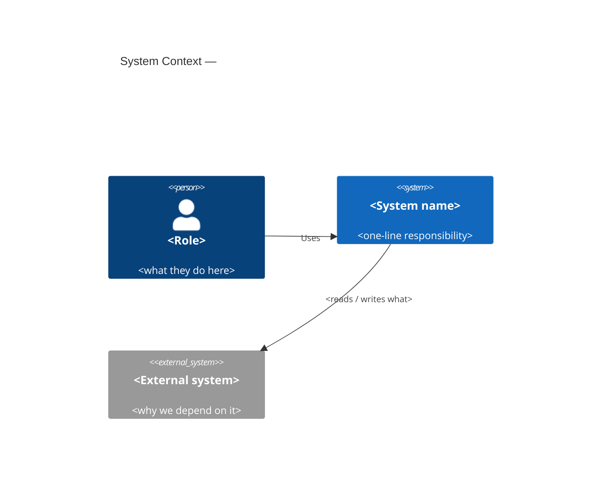
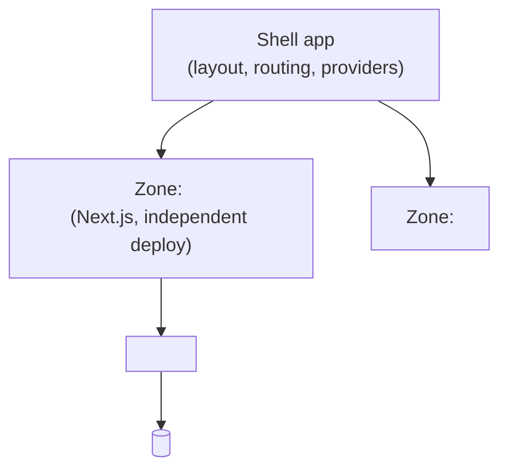

# <System name> — System Architecture

- **Last updated:** YYYY-MM-DD <!-- keep current; this is a living doc, not a point-in-time record -->
- **Owning team(s):** <the team(s) accountable for the system as a whole>
- **Maintainers:** <names / roles who keep this doc honest>
- **Status:** Active <!-- Active | Superseded by <doc> | Archived -->

> This is the **landscape view** (`rules/system-architecture.md`) — the current shape of the
> system. *Why* each structural decision was made lives in the linked **ADRs** (`docs/adr/`); the
> org's stance on a technology lives in the **Tech Radar** (`docs/radar/`). Keep this doc as deep
> as the system warrants — delete levels that don't apply.

## 1. System context (C4 L1)

One-paragraph summary: what this system is and the single job it does.

| Actor / external system | What it is | Why this system talks to it |
| ----------------------- | ---------- | --------------------------- |
| <Role / external>       | <…>        | <…>                         |

## 2. Containers (C4 L2 — the independently-deployable units)

> Fill this only if the system has **more than one deployable unit** (a shell + zones/remotes, a
> BFF/service, a separately-published package). A single-app project: write "Single Next.js app —
> see §3" and skip the table.

| Container | Responsibility | Tech | Deploy cadence | **Owning team** | ADR |
| --------- | -------------- | ---- | -------------- | --------------- | --- |
| shell     | Composes; no business logic | Next.js App Router | <e.g. on merge> | <team> | <ADR-NNNN> |
| <zone/remote/pkg> | <…> | <…> | <…> | <team> | <ADR-NNNN> |

Monorepo tier (`monorepo-architecture.md`): **Tier <1 modular monolith | 2 multi-zones | 3
federation>**, chosen because <the constraint that forced it> (ADR-NNNN).

## 3. Components & boundaries (C4 L3 — inside a container)

The feature slices and shared libs, and the **enforced** boundary rules (don't re-list every
component — name the slices + the rules).

- **Feature slices:** `features/<a>`, `features/<b>`, … — each vertically owned (`component-structure.md`).
- **Shared:** `shared/ui` (design system), `shared/tokens`, `shared/data`, `shared/util`.
- **Boundary enforcement:** Nx tags `type:*` + `scope:*` (+ `scope:team-*`, `team-ownership.md`),
  `@nx/enforce-module-boundaries` / `eslint-plugin-boundaries`. Allowed direction:
  `app → feature → data → util`; `app/feature → ui → tokens → util`. **No feature → feature.**

## 4. Data & contract flow

How data crosses container/external edges, and which contracts are versioned
(`contracts-and-versioning.md`, `services-and-data.md`).

| Edge (from → to) | Contract | Versioned? | Owner of the contract |
| ---------------- | -------- | ---------- | --------------------- |
| <shell → zone>   | <zone URL / rewrite> | <n/a or vN> | <team> |
| <feature → BFF>  | <OpenAPI / Zod schema> | <vN, expand-then-contract> | <team> |
| <BFF → external> | <their API> | <pinned vN> | <external> |

## 5. Team map (authoritative — `CODEOWNERS` + `scope:team-*` must agree)

| Team | Owns (containers / feature slices) | Reviews changes to |
| ---- | ---------------------------------- | ------------------ |
| <team-a> | `apps/shell`, `features/<x>` | same |
| <team-b> | `features/<y>`, `shared/ui` | same |

> This table is the source of truth for `team-ownership.md`. Keep `CODEOWNERS` and the
> `scope:team-*` Nx tags consistent with it.

## 6. Cross-cutting concerns

One line each, linking the owning rule:

- **Auth / session:** <where it lives> (`security.md`)
- **Observability:** <error tracking, web-vitals, logging> (`observability.md`)
- **i18n:** <namespaces, locales, RTL> (`i18n.md`)
- **Design system:** <the `shared/ui` + tokens package, how it's consumed> (`styling-and-tokens.md`)
- **Release / deploy:** <environments, promotion, flags> (`release-and-deploy.md`)

## Change log (structural changes only — each links its ADR)

| Date | Change | ADR |
| ---- | ------ | --- |
| YYYY-MM-DD | Initial landscape captured. | <ADR-NNNN> |
