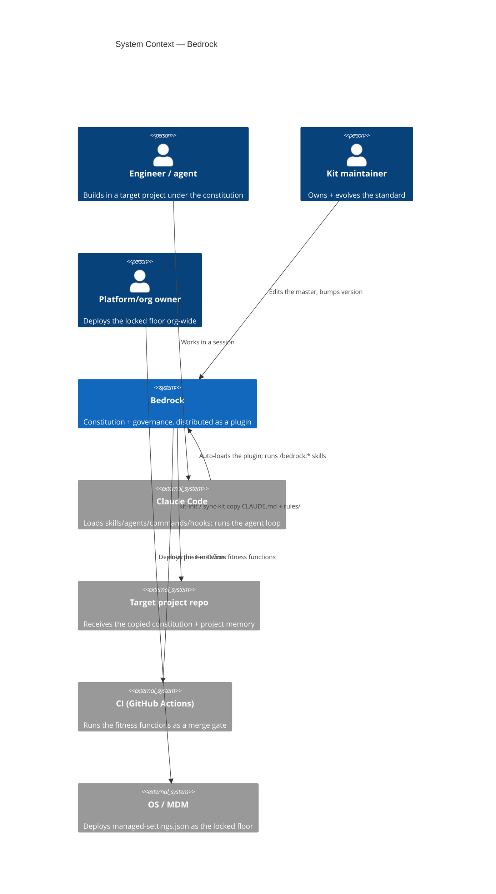
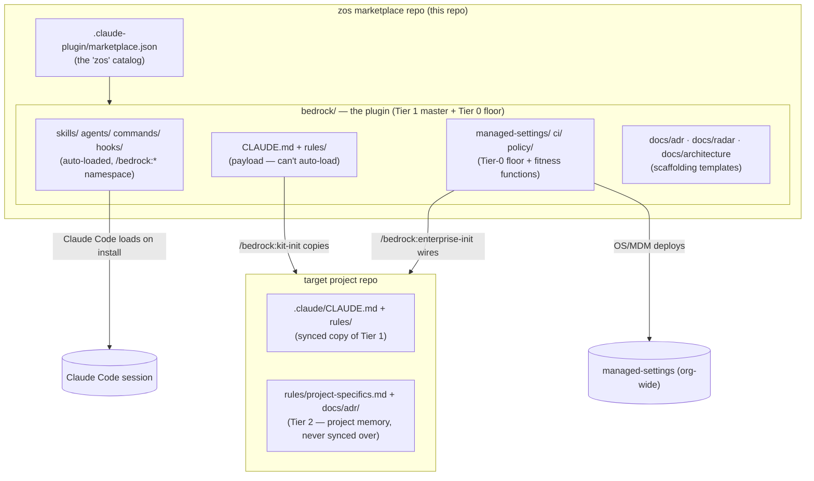

# Bedrock — System Architecture

- **Last updated:** 2026-05-25 <!-- living doc; update on any structural change to the kit -->
- **Owning team(s):** Zero One Stack — platform/standards
- **Maintainers:** kit maintainers (the `zos` marketplace owners)
- **Status:** Active

> This is the **landscape view** (`rules/system-architecture.md`) of Bedrock *itself* — the
> distribution system, not a runtime app. It's the first worked example of the template: Bedrock
> documenting its own shape (a marketplace → a plugin → a two-tier standard that propagates into
> projects). *Why* the big calls were made lives in the linked ADRs; this doc is the current shape.
>
> **Note on flexing the template:** Bedrock ships *standards*, it doesn't *run*. So "containers"
> here are distribution artifacts (the marketplace, the plugin, the copied payload), "data flow" is
> how the standard *propagates and is enforced*, and the "team map" is *who owns the standard vs.
> who owns each project's memory*. The template adapts — that's the point.

## 1. System context (C4 L1)

Bedrock is **one Claude Code plugin marketplace (`zos`) shipping one plugin (`bedrock`)**: a
portable, *enforced* Next.js/React engineering constitution plus an enterprise governance layer. It
exists so every project in a multi-team org builds to the **same** standard, adopts improvements
from **one** source, and can't silently drift — while still keeping per-project memory.

| Actor / external system | What it is | Why Bedrock talks to it |
| ----------------------- | ---------- | ----------------------- |
| Engineer / agent | The contributor (human or Claude) working in a target repo | They work *under* the constitution; the agent is an untrusted contributor (`governance.md`). |
| Kit maintainer | Owns the standard | The **only** writer of the universal constitution — improvements happen here, never by forking. |
| Platform/org owner | Deploys the locked floor | Owns Tier 0 (`managed-settings.json`) — the part projects can't weaken. |
| Claude Code | The harness | Auto-loads the plugin's skills/agents/commands/hooks; can't auto-load `CLAUDE.md`/`rules/` (the reason `kit-init` exists). |
| Target project repo | Where the standard lands | Receives the copied payload + grows its own Tier-2 memory. |
| CI (GitHub Actions) | The merge gate | Runs the fitness functions — the standard made build-breaking. |
| OS / MDM | Distributes the locked floor | Inherited, not overridable — that's what makes Tier 0 a floor. |

## 2. Containers (the distribution artifacts)

Bedrock's "containers" are not running processes — they're the units the standard is packaged and
shipped as. The two-tier governance model (`governance.md`) maps directly onto them.

| Container | Responsibility | Tech | "Deploy" cadence | **Owning team** | ADR |
| --------- | -------------- | ---- | ---------------- | --------------- | --- |
| `.claude-plugin/marketplace.json` (`zos`) | The catalog one plugin is listed in | JSON manifest | On release (pin version) | Kit maintainers | — |
| `bedrock/` plugin — auto-loaded (`skills/ agents/ commands/ hooks/`) | Capabilities Claude Code loads on install (`/bedrock:*`) | Markdown + bash hooks | `/plugin update` | Kit maintainers | — |
| `bedrock/` plugin — payload (`CLAUDE.md + rules/`) | The constitution; **can't** auto-load — `kit-init` copies it in | Markdown | `/bedrock:kit-init` / `/sync-kit` | Kit maintainers (master) → project (its copy) | — |
| `bedrock/` plugin — Tier-0 floor (`managed-settings/ ci/ policy/`) | The locked, non-weakenable controls + CI fitness functions | JSON + YAML + rego + bash | OS/MDM deploy + `enterprise-init` | Platform/org owner | — |
| Target project's Tier-2 memory (`project-specifics.md`, `docs/adr/`, `docs/architecture/`) | The project's own living + durable memory | Markdown | Written by agents during normal work | The project team | per project |

Monorepo tier (`monorepo-architecture.md`): **n/a — Bedrock is a single distributable, not an app
workspace.** (It *describes* the tiers; it isn't structured by them.) Earlier drafts split Bedrock
into a base kit + a separate enterprise overlay; that split was removed — **one plugin** (see
ROADMAP).

## 3. Components & boundaries

Inside the plugin, the "components" are the rule files and the agent loop, with boundaries enforced
by **convention + the kit's own authoring rules** (not Nx — there's no build graph here).

- **The constitution router:** `CLAUDE.md` holds *only* hard bans + a routing table; **it never
  grows**. Depth lives in `rules/*.md`, one concern per file, loaded on demand.
- **The rule library:** `rules/` — each file follows the authoring convention (banner · why · rule
  + templates · ❌/✅ · checklist · sources), indexed in `rules/README.md` and routed from
  `CLAUDE.md`. Enterprise rules are marked ⛨ and applied via `enterprise-init`.
- **The agent loop:** `frontend-architect` (plan) → `component-builder` (build) → `verify-build`
  (skill) → `frontend-reviewer` (review + runs verify); `adr-author`/`monorepo-architect` for the
  cross-cutting roles.
- **Boundary rule (the kit's own invariant):** new guidance = a new `rules/*.md` + one routing row
  + one index row — **never** more prose in `CLAUDE.md`. New action = a skill; new role = an agent.
  This is the boundary that keeps the kit skimmable as it grows (and the one this very change
  followed).

## 4. Data & contract flow (how the standard propagates + is enforced)

The "data" Bedrock moves is **the standard itself**, and the contracts are the propagation/enforce
mechanisms — the analog of API contracts for a runtime system.

| Edge (from → to) | Contract | Versioned? | Owner |
| ---------------- | -------- | ---------- | ----- |
| Master → plugin install | `plugin.json` `version` (semver) | **Yes** — bumped per release; `marketplace.json` pins it | Kit maintainers |
| Plugin → project (Tier 1) | `kit-init` / `sync-kit` copy `CLAUDE.md` + `rules/`; **never** touch `project-specifics.md` | Tracks plugin `version` | Maintainers → project |
| Plugin → project (Tier 0) | `enterprise-init` wires hooks + CI fitness functions + policy | Tracks plugin `version` | Platform owner |
| Org floor → all machines | `managed-settings.json` via OS/MDM | Org-controlled | Platform owner |
| Project → merge | CI fitness functions (dependency-cruiser, a11y, SBOM, ADR-gate, token-coverage, policy waivers) as a **build-breaking** gate | Per repo | Project team |
| Deviation → standard | A logged, **expiring** waiver: an ADR + a dated row in `project-specifics.md` Approved overrides + `policy/waivers.yaml` | Expiry date | Project team (+ approver) |

**The invariant:** improve the standard *here*, bump `version`, projects adopt via
`/plugin update` + `/sync-kit` — **never by forking the constitution.** That one-way flow is what
keeps every project consistent.

## 5. Team map (who owns what in the standard)

| Team / role | Owns | Reviews changes to |
| ----------- | ---- | ------------------ |
| Kit maintainers | The universal constitution (`CLAUDE.md`, all `rules/*.md` except `project-specifics.md`), agents, skills, commands; the `zos` marketplace + plugin version | Any change to Tier 1 (the master) |
| Platform / org owner | The Tier-0 locked floor: `managed-settings.json`, the enforcement hooks, the CI fitness-function set | Changes to what projects can't weaken |
| Senior technologists | The Tech Radar (`docs/radar/`) — the org's Adopt/Trial/Assess/Hold stance | Ring movements, reviewed ~quarterly |
| Each project team | Their Tier-2 memory: `project-specifics.md`, `docs/adr/`, their `docs/architecture/<system>.md` | Their own project; cross-team edits per `team-ownership.md` |

> For a *project* this table is mirrored by `CODEOWNERS` + `scope:team-*` tags
> (`team-ownership.md`). Bedrock-the-repo is maintainer-owned throughout, so its `CODEOWNERS` (if
> any) is a single team — the multi-team mechanism is what Bedrock *ships*, not how Bedrock itself
> is split.

## 6. Cross-cutting concerns

- **Enforcement:** deterministic hooks (SessionStart context, PreToolUse ban-block, PostToolUse
  audit) + CI fitness functions + policy-as-code waivers. The standard is real because a machine
  enforces it (`ci.md`, `governance.md`).
- **Durable memory:** immutable append-only ADRs (`adr.md`) under the org-level Tech Radar
  (`tech-radar.md`); this landscape doc is the synthesis above both (`system-architecture.md`).
- **Compliance as evidence:** the audit log + ADRs + CI gates *are* the SOC 2 / accessibility-law
  evidence — produced by normal work (`compliance.md`).
- **Anti-hallucination spine:** Step 0 Recon gate + illustrative-not-literal examples; every name
  in `rules/` is illustrative until verified against the real repo.

## Change log (structural changes only)

| Date | Change | ADR |
| ---- | ------ | --- |
| 2026-05-25 | Initial landscape captured. Added the system-architecture layer (this doc + the rule + template) as the multi-team scale layer. | [ADR-0001](../adr/0001-multi-team-scale-layer.md) |
| (earlier) | Merged the base kit + enterprise overlay into one plugin. | see ROADMAP / commit `2908bb3` |
